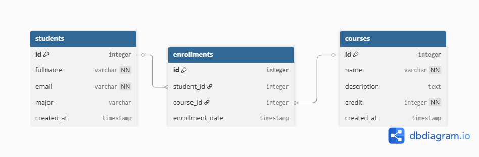
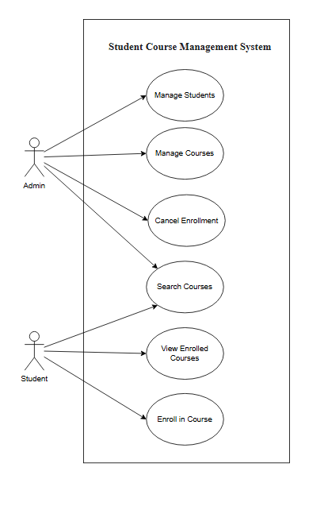

# 🎓 Student Course Management System

> **🚀 [Live Demo]()**

**is a web-based application designed to facilitate the management of academic records. It provides a comprehensive interface for administrators to manage students, courses, and enrollments efficiently. The system features a modern, responsive user interface and a robust RESTful API backend.**

**Key Features:**

- **Student Management:** Create, read, update, and delete student records.
- **Course Management:** Manage course details including credits and descriptions.
- **Enrollment System:** Enroll students in courses via a modal interface and view their schedules.
- **Search Functionality:** Real-time search for students located in the header for easy access.
- **Responsive Design:** Optimized for both desktop and mobile devices with a modern UI.

---

## 🛠️ Tech Stack

### **Backend**

- **Runtime:** Node.js
- **Framework:** Express.js
- **Database** Supabase (PostgreSQL)

### **Frontend**

- **Core:** HTML5, CSS3, JavaScript (ES6+)
- **Framework:** Bootstrap 5
- **Icons:** Font Awesome
- **Typography:** Google Fonts (Poppins)

### **Tools**

- **Deployment:** Render
- **Testing:** Postman

---

### 1. Entity-Relationship Diagram (ERD)

แผนภาพแสดงความสัมพันธ์ระหว่างตาราง `students`, `courses`, และ `enrollments`



### 2. Use Case Diagram

แผนภาพแสดงขอบเขตการทำงานของ **Admin/Staff** (ผู้ดูแลระบบ) และ **Student** (นักเรียน)



---

## 🗄️ Database Design

### Schema & Keys Concept

การออกแบบฐานข้อมูลใช้หลักการ Relational Database โดยมีรายละเอียดดังนี้:

- **Primary Key (PK):** ใช้ระบุแถวข้อมูลที่ไม่ซ้ำกันในตาราง (Unique Identifier) เช่น `id` ในตาราง students
- **Foreign Key (FK):** ใช้เชื่อมโยงความสัมพันธ์ระหว่างตารางเพื่อรักษา **Referential Integrity**
  - `enrollments.student_id` เชื่อมไปยัง `students.id`
  - `enrollments.course_id` เชื่อมไปยัง `courses.id`

### Normalization (3NF)

โครงสร้างตารางผ่านการทำ **Normalization** ถึงระดับ **3NF** เพื่อลดความซ้ำซ้อนของข้อมูล:

1.  **1NF (First Normal Form):** ข้อมูลในแต่ละ Column เป็นค่าเดี่ยว (Atomic) ไม่มีการเก็บค่าซ้ำซ้อนในช่องเดียว
2.  **2NF (Second Normal Form):** ทุก Column ที่ไม่ใช่ Key ขึ้นอยู่กับ Primary Key ทั้งหมด (แยกตาราง Students และ Courses ออกจากกันชัดเจน)
3.  **3NF (Third Normal Form):** ไม่มี Transitive Dependency (ข้อมูลรายละเอียดของนักเรียนจะไม่ไปปรากฏซ้ำในตาราง Enrollments แต่จะใช้ `student_id` อ้างอิงแทน)

---

## 🚀 API Design & Architecture

### RESTful Principles

- **Resources:** เข้าถึงข้อมูลผ่าน URL ที่สื่อความหมาย (เช่น `/students`, `/courses`)
- **HTTP Methods:** ใช้ Method ตามมาตรฐาน
  - `GET`: ดึงข้อมูล (Read)
  - `POST`: สร้างข้อมูลใหม่ (Create)
  - `PUT`: แก้ไขข้อมูล (Update)
  - `DELETE`: ลบข้อมูล (Delete)

### Router Management

ใช้ **Express Router** ในการจัดการเส้นทาง (Routing) เพื่อความเป็นระเบียบและ Modular:

- แยก Endpoint ตาม Resource (เช่น กลุ่ม Student, กลุ่ม Course)
- รองรับ Middleware สำหรับจัดการ Request Body (JSON parsing) และ CORS

---

## 🔌 Supabase Connection

**ตัวอย่างการเชื่อมต่อ (Implementation):**

```javascript
const { createClient } = require("@supabase/supabase-js");

// โหลดค่า Config จาก Environment Variables
const supabase = createClient(
  process.env.SUPABASE_URL,
  process.env.SUPABASE_KEY
);

module.exports = supabase;
```

---

## 🧪 API Test Cases & Error Handling

ตารางการทดสอบ API

| Test ID   | Test Scenario     |  Method  | Endpoint                | Params / Body                   | Result          |
| :-------- | :---------------- | :------: | :---------------------- | :------------------------------ | :-------------- |
| **TC-01** | Create Student    |  `POST`  | `/students`             | `fullname`, `email`, `major`    | 201 Created     |
| **TC-02** | Get All Students  |  `GET`   | `/students`             | -                               | 200 OK          |
| **TC-03** | Update Student    |  `PUT`   | `/students/:id`         | `fullname`, `email`, `major`    | 200 OK          |
| **TC-04** | Delete Student    | `DELETE` | `/students/:id`         | -                               | 200 OK          |
| **TC-06** | Create Course     |  `POST`  | `/courses`              | `name`, `description`, `credit` | 201 Created     |
| **TC-07** | Get All Courses   |  `GET`   | `/courses`              | -                               | 200 OK          |
| **TC-08** | Update Course     |  `PUT`   | `/courses/:id`          | `name`, `desc`, `credit`        | 200 OK          |
| **TC-09** | Delete Course     | `DELETE` | `/courses/:id`          | -                               | 200 OK          |
| **TC-10** | Enroll Course     |  `POST`  | `/enrollments`          | `student_id`, `course_id`       | 201 Created     |
| **TC-11** | View My Courses   |  `GET`   | `/students/:id/courses` | -                               | 200 OK          |
| **TC-12** | Cancel Enrollment | `DELETE` | `/enrollments/:id`      | -                               | 200 OK          |
| **TC-13** | Error Handling    |  `POST`  | `/students`             | _(Missing required fields)_     | 400 Bad Request |

### Expected Output & Error Handling

**1. Success Response (200/201):**
คืนค่าข้อมูล JSON พร้อม Status Code

```json
// ตัวอย่าง (201 Created)
[
  {
    "id": 1,
    "fullname": "Win Tester",
    "email": "win@test.com",
    "major": "IT"
  }
]
```

**2. Error Response (400/500):**
กรณีเกิดข้อผิดพลาด จะคืนค่าเป็น JSON Object ที่มี key ชื่อ `error` เสมอ

```json
// ตัวอย่าง (400 Bad Request)
{
  "error": "null value in column 'email' violates not-null constraint"
}
```

---

## 🔄 Git Workflow

กระบวนการจัดการ Version Control ใช้ GitHub โดยมีขั้นตอนดังนี้:

1.  **Main Branch:** เป็น Branch หลักสำหรับ Code ที่พร้อมใช้งาน (Production-ready)
2.  **Feature Branches:** เมื่อต้องการพัฒนาฟีเจอร์ใหม่ ให้แตก Branch ออกมา เช่น `feature/add-student-api`
3.  **Commit:** ใช้ข้อความ Commit ที่สื่อความหมาย (Descriptive messages)
4.  **Pull Request (Merge Request):** เมื่อพัฒนาเสร็จ ให้ทำ Pull Request เพื่อตรวจสอบ Code ก่อน Merge เข้า Main Branch

---

## 🚀 Getting Started

ทำตามขั้นตอนด้านล่างเพื่อรันระบบบนเครื่อง Local:

1.  **Clone Repository**

    ```bash
    git clone https://github.com/windme2/student-course.git
    cd student-course
    ```

2.  **Install Dependencies**
    ติดตั้ง Library ที่จำเป็น

    ```bash
    npm install
    ```

3.  **Run the Server**
    ```bash
    npm run start
    # หรือแบบ Development mode (recommended)
    npm run dev
    ```

---

## 🔧 Configuration

สร้างไฟล์ `.env` ที่ Root Folder และกำหนดค่าตัวแปรดังนี้:

```env
# URL ของโปรเจกต์ Supabase
SUPABASE_URL=https://your-project.supabase.co

# API Key (anon public)
SUPABASE_KEY=your-anon-key

# Port สำหรับรัน Server
PORT=3000
```

---

## ☁️ Deployment

### Steps to Deploy on Render

ขั้นตอนการนำระบบขึ้นออนไลน์ผ่าน Render:

1.  **Push to GitHub:** ตรวจสอบให้แน่ใจว่า Code ล่าสุดถูก Push ขึ้น GitHub Repository เรียบร้อยแล้ว
2.  **Create Web Service:** เข้าไปที่ Dashboard ของ Render กด New -> Web Service และเชื่อมต่อกับ GitHub Repo
3.  **Configure Build:** ตั้งค่าคำสั่งสำหรับการ Build และ Run
    - **Build Command:** `npm install`
    - **Start Command:** `node index.js`
4.  **Environment Variables:** เพิ่มค่า `SUPABASE_URL` และ `SUPABASE_KEY` ในเมนู Environment ของ Render

### Cloud Deployment Analysis

วิเคราะห์ข้อดี-ข้อเสียของการ Deploy บน Cloud (Render):

- **✅ Pros (ข้อดี):**
  - **High Availability:** ระบบออนไลน์ตลอด 24 ชม.
  - **Automated CI/CD:** Deploy อัตโนมัติเมื่อมีการ Push Code
  - **Access Anywhere:** เข้าถึง API ได้จากทุกที่ผ่าน Public URL
- **❌ Cons (ข้อเสีย):**
  - **Dependency:** ต้องพึ่งพาอินเทอร์เน็ตในการเข้าถึงและจัดการ
  - **Cold Start:** ใน Free Tier อาจใช้เวลาตื่นตัวเล็กน้อยเมื่อมี Request แรกหลังจากไม่ได้ใช้นาน

---

## 🤝 Contributing

1. Fork the project on GitHub (กด **Fork** ที่หน้า repository)
2. Create a feature branch: `git checkout -b feature/your-feature-name`
   (เช่น `feature/add-student-endpoint`)
3. Commit changes with a clear message: `git commit -m "feat: add ..."` (หรือรูปแบบข้อความที่ทีมตกลง)
4. Push the branch: `git push origin feature/your-feature-name`
5. Open a Pull Request and include:
   - Short description of the change (คำอธิบายสั้น ๆ)
   - Steps to reproduce or test (วิธีทดสอบ)
   - Screenshots or sample request/response if applicable

Optional:

- Run tests (if any) before opening PR and mention CI status.
- Follow existing code style and include small, focused commits.

---

## 📝 License

This project is licensed under the MIT License.
